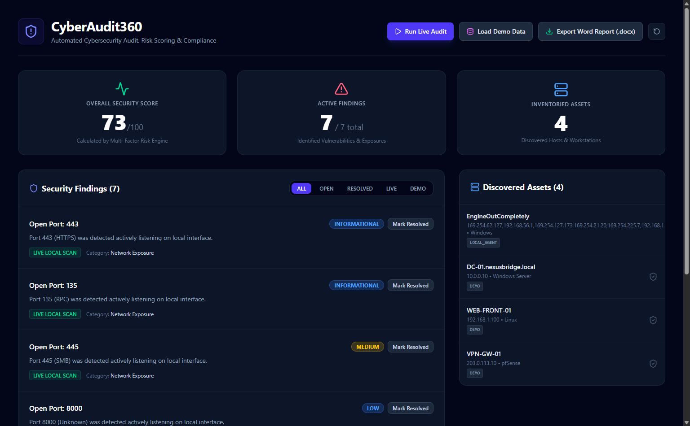
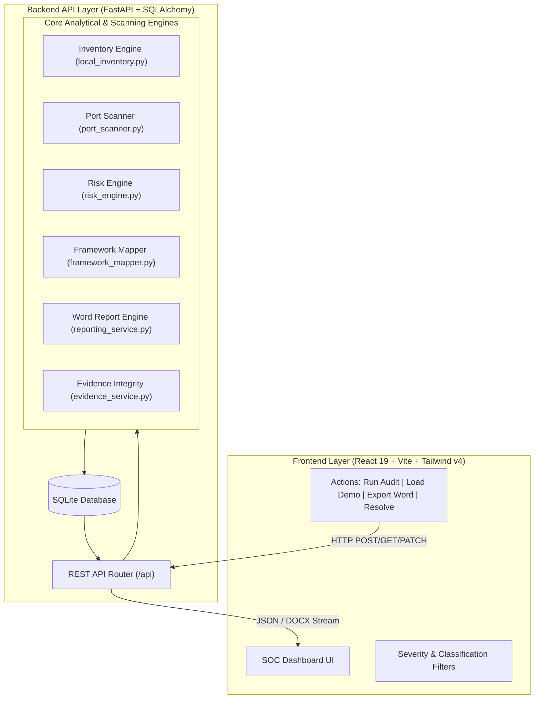

# CyberAudit360 🛡️
> **Automated Cybersecurity Audit, Risk Prioritization & Compliance Assurance Platform**

[](https://www.python.org/)
[](https://fastapi.tiangolo.com/)
[](https://react.dev/)
[](https://tailwindcss.com/)
[](https://python-docx.readthedocs.io/)
[-brightgreen.svg?logo=pytest&logoColor=white)](https://docs.pytest.org/)
[](https://opensource.org/licenses/MIT)

---

## 📸 Platform Dashboard

<!-- ================================================================= -->
<!--                    DASHBOARD SCREENSHOT PREVIEW                   -->
<!--  You can replace 'docs/screenshots/dashboard.png' with your own   -->
<!--  image anytime. The project includes a live capture below.        -->
<!-- ================================================================= -->

<p align="center">
  
</p>

<p align="center">
  <em>Figure 1: CyberAudit360 Interactive SOC Dashboard featuring real-time 0–100 Security Scoring, Live Local Scan badging, and automated findings management.</em>
</p>

> 💡 **Tip for Adding More Screenshots:**  
> Place your images in [`docs/screenshots/`](docs/screenshots/) (e.g., `word_report_sample.png`, `terminal_run.png`) and link them using standard markdown syntax:  
> ``

---

## 📑 Executive Summary & Abstract

**CyberAudit360** is a modern, defensive cybersecurity audit and assurance system designed to solve critical pain points in vulnerability management, internal baseline auditing, and regulatory compliance.

In many modern organizations, cybersecurity assessments face significant bottlenecks:
- **Audit Fatigue & Static Reports:** Routine audits result in static spreadsheets or stale PDF exports that fail to reflect dynamic infrastructure updates.
- **Cost & Complexity of Commercial Scanners:** Enterprise tools (e.g., Tenable Nessus, Qualys, Rapid7) are often resource-heavy, expensive, and overly intrusive for basic internal hygiene checks.
- **Disconnected Compliance Mapping:** Security analysts spend hours manually correlating technical CVE findings to regulatory frameworks like **NIST CSF 2.0**, **CIS Controls v8.1**, and **ISO/IEC 27001**.

**CyberAudit360** bridges these gaps by providing an automated, lightweight, and safe-by-design assessment suite. It combines local asset fingerprinting, non-intrusive socket inspection, multi-factor risk prioritization, automated compliance mapping, and executive-grade Word (`.docx`) report generation into an intuitive, single-pane-of-glass SOC interface.

---

## 🌟 Key Capabilities & Highlights

| Feature | Description |
|---|---|
| 🔍 **Live Local Auditing** | Passively discovers local machine metadata (OS release, architecture, hostname) and scans loopback interface (`127.0.0.1`) listening sockets safely. |
| 🧮 **Dynamic Risk Scoring Engine** | Calculates a 0–100 overall security posture score based on CVSS v3.1 technical severity, asset business criticality, internet exposure, and CISA KEV status. |
| 🏛️ **Compliance Framework Mapping** | Dynamically maps discovered vulnerabilities to corresponding controls in **NIST CSF 2.0**, **CIS Controls v8.1**, and **ISO/IEC 27001**. |
| 📄 **Executive Word (`.docx`) Reporting** | Generates executive-ready Microsoft Word audit reports complete with formatted scorecards, compliance tables, and auditor sign-off blocks. |
| 🔐 **Evidence Chain-of-Custody** | Computes cryptographic **SHA-256** digests on collected audit evidence to ensure tamper-proof audit trails. |
| 🧪 **Interactive Remediation Workflow** | Allows security teams to mark findings as `RESOLVED` directly in the UI, dynamically boosting the overall security score in real time. |
| 🏢 **Enterprise Demo Scenarios** | Includes a pre-seeded simulated enterprise scenario (*NexusBridge Technologies Pvt. Ltd.*) clearly distinguished from real local audit data. |
| 🚀 **1-Click Plug-and-Play Launchers** | Ships with turnkey startup scripts (`run.bat`, `run.ps1`, `run.sh`) that configure environments and launch the application in one command. |

---

## 🏗️ System Architecture & Engineering Design

CyberAudit360 is built on a modular decoupled architecture dividing defensive scanning, data persistence, analytical engines, and real-time presentation:



---

## 🔬 Core Assessment Engines

### 1. Controlled Local Inventory & Port Scanner
- **Inventory Service:** Safely interrogates local system properties using standard Python standard libraries (`platform`, `socket`, `psutil`) without spawning shell exploits or elevated privilege escalation.
- **Port Scanner:** Employs concurrent, controlled TCP handshake attempts (`socket.connect_ex`) against standard service ports (`21`, `22`, `80`, `443`, `445`, `3389`, `5173`, `8000`, etc.) strictly bound to `127.0.0.1`.

### 2. Multi-Factor Risk Scoring Algorithm
Rather than relying on basic severity labels, CyberAudit360 uses a weighted formula:

$$\text{Base Score} = \text{CVSS v3.1} \quad \text{or} \quad \frac{\text{Likelihood (1--5)} \times \text{Impact (1--5)}}{2.5}$$

$$\text{Final Finding Risk} = \text{Base Score} \times \text{Exposure Multiplier} \times \text{KEV Multiplier} \times \text{Asset Multiplier}$$

- **Exposure Multiplier:** `1.3×` if internet-facing.
- **CISA KEV Multiplier:** `1.5×` if listed on the Known Exploited Vulnerabilities catalog.
- **Asset Criticality Multiplier:** `1.5×` (Critical), `1.2×` (High), `1.0×` (Medium), `0.8×` (Low).

#### Overall Security Score Formula (0–100 Normalized):
$$\text{Security Score} = \max\left(0, \, 100 - (15 \times N_{\text{critical}} + 5 \times N_{\text{high}} + 2 \times N_{\text{medium}})\right)$$
*Resolved findings automatically waive their penalty, providing immediate real-time feedback when remediations are executed.*

### 3. Compliance Framework Mapping
Correlates findings into three primary governance frameworks:
- **NIST CSF 2.0:** Category mappings across *Identify (ID)*, *Protect (PR)*, *Detect (DE)*, *Respond (RS)*, and *Recover (RC)*.
- **CIS Controls v8.1:** Asset Management (Control 4), Access Control (Control 6), Network Infrastructure Management (Control 9).
- **ISO/IEC 27001:2022:** Annex A controls (A.8.8 Management of technical vulnerabilities, A.8.20 Network security).

### 4. Executive Word (`.docx`) Report Generation
Utilizes `python-docx` and low-level XML styling to dynamically compile:
- Formatted cover titles, executive metadata blocks, and security score badges.
- Compliance alignment percentage tables.
- Finding details with colored severity highlights and actionable recommendations.
- Legal non-repudiation clauses with SHA-256 evidence digests and formal sign-off lines.

---

## 🛠️ Technology Stack

| Component | Technology | Version | Purpose |
|---|---|---|---|
| **Backend Framework** | FastAPI | `^0.104.1` | Asynchronous REST API, high-speed routing, automated OpenAPI docs |
| **Server Engine** | Uvicorn | `^0.23.2` | Production-ready ASGI server |
| **ORM & Database** | SQLAlchemy & SQLite | `^2.0.23` | Structured schema modeling, foreign-key relationships, zero-config local DB |
| **Data Validation** | Pydantic v2 | `^2.4.2` | Request/response schema contracts and settings management |
| **Document Generation** | python-docx | `^1.1.0` | Executive Microsoft Word (`.docx`) compilation |
| **Testing Suite** | pytest & httpx | `^7.4.3` | Unit tests and end-to-end API integration verification |
| **Frontend Framework** | React | `^19.3.0` | Declarative, component-driven user interface |
| **Build Tool** | Vite | `^8.3.0` | Next-generation frontend tooling and instant HMR |
| **CSS Framework** | Tailwind CSS | `v4.3.3` | Modern, responsive dark-theme SOC design |
| **Iconography** | Lucide React | `^1.47.0` | Vector security and status iconography |

---

## 🚀 Quick Start Guide (1-Click Run & Use)

### Option A: 1-Click Launchers (Turnkey / Easiest)

- **On Windows (Command Prompt):**
  Double-click [`run.bat`](file:///e:/Projects/CyberAudit360/run.bat)
- **On Windows (PowerShell):**
  ```powershell
  .\run.ps1
  ```
- **On Linux / macOS:**
  ```bash
  chmod +x run.sh && ./run.sh
  ```
*The launcher automatically configures virtual environments, installs Python and npm packages, starts both servers, and opens the dashboard in your default browser.*

---

### Option B: Manual Step-by-Step Setup

#### 1. Clone the Repository
```bash
git clone https://github.com/<your-username>/CyberAudit360.git
cd CyberAudit360
```

#### 2. Configure & Start Backend
```powershell
# Windows PowerShell
cd backend
python -m venv venv
.\venv\Scripts\Activate.ps1
pip install -r requirements.txt
uvicorn app.main:app --reload --port 8000
```
```bash
# Linux / macOS
cd backend
python3 -m venv venv
source venv/bin/activate
pip install -r requirements.txt
uvicorn app.main:app --reload --port 8000
```

#### 3. Configure & Start Frontend
In a second terminal:
```bash
cd frontend
npm install
npm run dev
```

- **Dashboard UI:** [http://localhost:5173/](http://localhost:5173/)
- **Swagger OpenAPI Docs:** [http://127.0.0.1:8000/docs](http://127.0.0.1:8000/docs)

---

## 🧭 REST API Reference

All backend endpoints are documented interactively via Swagger UI at `/docs`:

| Method | Route | Description | Request / Response |
|---|---|---|---|
| `GET` | `/api/health` | Service health status check | `{"status": "ok", "project": "..."}` |
| `GET` | `/api/assets` | Retrieve all inventoried assets | `List[Asset]` |
| `POST` | `/api/assets` | Register a new asset | `AssetCreate` -> `Asset` |
| `GET` | `/api/findings` | Retrieve all active and resolved findings | `List[Finding]` |
| `GET` | `/api/score` | Compute overall 0–100 security score | `{"score": int, "explanation": str}` |
| `POST` | `/api/scan` | Trigger a live safe local machine & port scan | `{"status": "success", "total_open_ports": int}` |
| `POST` | `/api/demo/seed` | Load simulated enterprise scenario | `{"status": "success", "message": "..."}` |
| `POST` | `/api/demo/reset` | Clear all data for a clean assessment | `{"status": "success", "message": "..."}` |
| `PATCH` | `/api/findings/{id}/toggle-status` | Toggle finding between `OPEN` and `RESOLVED` | `{"id": str, "new_status": str}` |
| `GET` | `/api/report/export` | Download Executive Report (`.docx` or `.md`) | Streamed Word Document (`.docx`) |

---

## 🧪 Automated Testing & Verification

CyberAudit360 includes automated unit and integration tests verifying risk logic, port scanning, and API integrity:

```powershell
cd backend
# With virtual environment activated:
python -m pytest -v
```

### Test Coverage Results (100% Passing):
- `tests/test_api.py::test_health_check` **PASSED**
- `tests/test_api.py::test_get_findings_and_score` **PASSED**
- `tests/test_api.py::test_scan_endpoint` **PASSED**
- `tests/test_port_scanner.py::test_scan_port_closed` **PASSED**
- `tests/test_port_scanner.py::test_scan_target` **PASSED**
- `tests/test_risk_engine.py::test_calculate_finding_risk` **PASSED**
- `tests/test_risk_engine.py::test_calculate_overall_security_score` **PASSED**

---

## 🔒 Safety, Privacy & Ethical Constraints

CyberAudit360 adheres strictly to defensive security standards:
- **Zero Destructive Exploits:** The platform conducts non-intrusive metadata queries and standard socket connection attempts. It does not exploit vulnerabilities, fuzz inputs, or harvest credentials.
- **Local Loopback Scoping:** Live assessment features are strictly bounded to the host loopback adapter (`127.0.0.1`). It never scans remote networks without explicit configuration.
- **Audit Data Transparency:** Synthetic enterprise data is permanently badged as `DEMO DATA` to ensure real vulnerabilities and test scenarios are never conflated.

---

## 📄 License
This project is licensed under the [MIT License](LICENSE) - see the LICENSE file for details.
